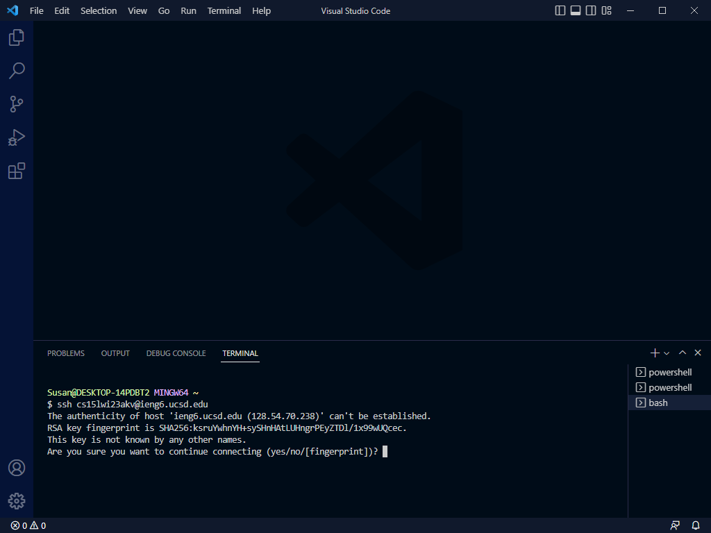
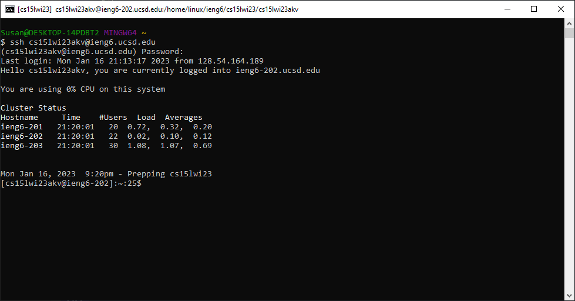
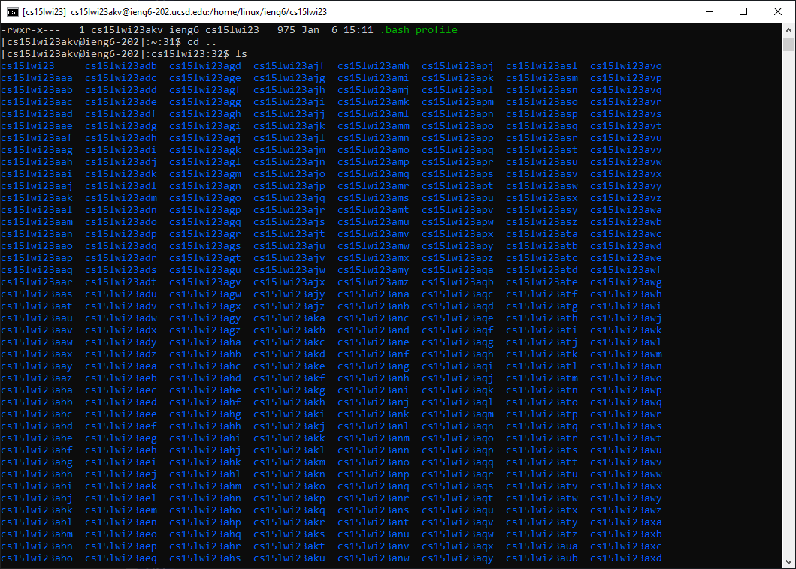

# Lab Report 1

## Remote Login

The first step to connecting to a remote server is to set up your environment. 

### Installing the software
For a windows environment, you will need to download VSCode and Git.

To install VSCode, go to this website : [https://code.visualstudio.com](https://code.visualstudio.com)

To install Git for windows : [https://gitforwindows.org](https://gitforwindows.org) or [https://git-scm.com/download/win](https://git-scm.com/download/win)

To install Git for macOS : [https://git-scm.com/download/mac](https://git-scm.com/download/mac)

For more information on installing Git : [https://git-scm.com/book/en/v2/Getting-Started-Installing-Git](https://git-scm.com/book/en/v2/Getting-Started-Installing-Git)

To use the bash terminal, Git needs to be installed. 

### Bash Terminal

To connect to the remote server, the bash terminal needs to be acessed. 

1. Acess the command palette by using `Ctrl` + `Shift` + `P`
2. In the command palette, type `Select Default Profile`
3. From the command palette, select `Git Bash`
4. Once selected, you can acess the bash terminal in the terminal window by pressing the `+` button

### ETS Account

Once your environment is set up, you can find your ETS account here, [ETS Account](https://sdacs.ucsd.edu/~icc/index.php), which provides the necessary resources to acessing the remote server. In order to access the server, you also need your password. [Reset your password](https://docs.google.com/document/d/1hs7CyQeh-MdUfM9uv99i8tqfneos6Y8bDU0uhn1wqho/edit)

Once you have your username and password, you can now access the remote server.

## Remote Connecting

In the bash terminal, type `ssh` followed by your `username` and `@ieng6.ucsd.edu`

It should look something like this: `ssh cs15lwi23zzz@ieng6.ucsd.edu` where `zzz` is your specific account.

If this is your first time connecting to the server, the command prompt will ask if you want to continue connecting.

If you type yes, the RSA will be added to a list of known hosts on your computer.

Retype the `ssh` command and log in with your password.

### Try Some Commands!

Now that you are in the remote server you can play around with some of the commands in the terminal.

For example, you can `cd` into the `..` directory and type `ls` see the users on the server.

If you find that your terminal is too cluttered frum typing nonsensical commands, you can `clear` it!

Once you're done playing around the remote server, you can log out by using `ctrl` + `D` and typing `exit`

